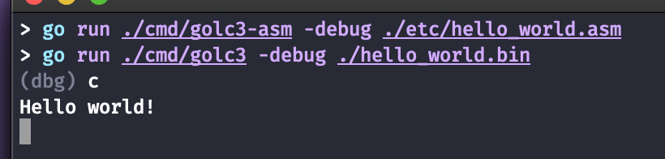
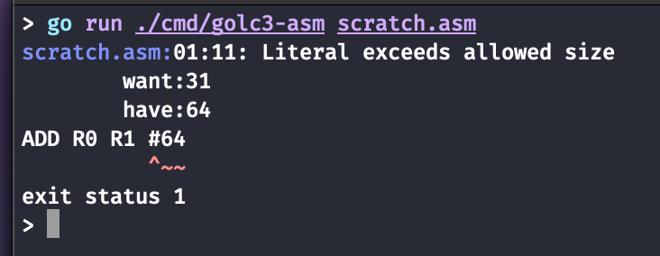
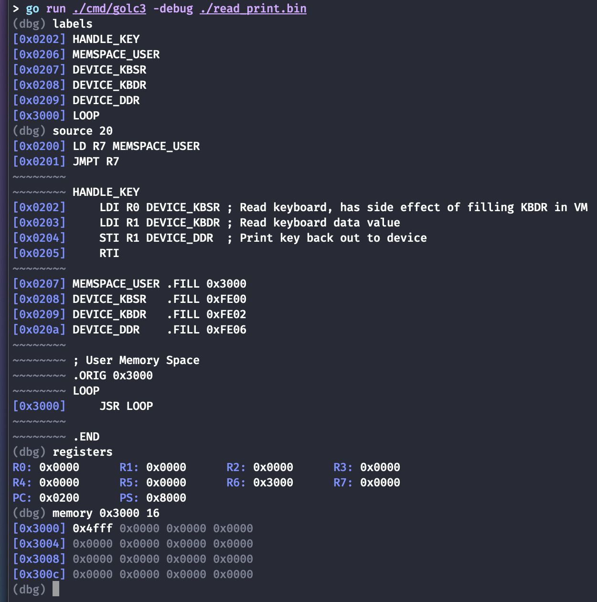

# golc3

A Golang assembler, virtual machine, and debugger written for the LC3 machine
architecture.



# Installation

```bash
$ go get github.com/lassandro/golc3/

$ cd "$GOPATH/github.com/lassandro/golc3"
$ go install cmd/golc3-asm
$ go install cmd/golc3
```

# Assembler



```bash
$ golc3-asm [-debug] [-out <outfile>] <file>
```

The assembler takes in LC3 assembly files and generates a binary compatible with
the LC3 architecture.

The `-out` flag dictates the location of the output file, otherwise the input
`<file>` name will be used, with an extension of `.bin`.

The `-debug` flag can be used to generate a symbol table file to associate with
the input file. The symbol table contains the following information:
- Which addresses in the binary contain instructions
- Where in the source file a given instruction is located
- What labels were declared in the source file and what memory locations they
  represent
- The absolute file path of the input `<file>`

The assembler can also take files via stdin using pipes:

```bash
$ cat test.asm | golc3-asm
```

**NOTE:** Certain extended-LC3 features are not currently implemented, so not all
        LC3 source files may may be assembled by this program. See
        [Caveats](#Caveats) for more information.

# Virtual Machine

```bash
$ golc3 <file>
```

The virtual machine loads and executes LC3 binaries.

When the machine begins the terminal is put into raw mode: stdin will be
available immediately and can be utilized by the virtual machine as the input
keyboard device.

When the machine is instructed to write to the Display Data Register (DDR,
0xFE06), the character will be written to stdout and stdout will be immediately
flushed.

The machine can be halted and the program exited at any time using ^C.

**NOTE:** Certain extended-LC3 features are not currently implemented, so not all
        LC3 binaries may work correctly with this program. See
        [Caveats](#Caveats) for more information.

# Debugger



```bash
$ golc3 -debug <file>
```

The debugger can be enabled with the `-debug` flag when running the virtual
machine, and can be used to examine the machine state as the machine executes
the LC3 binary.

When the debugger halts execution, the program will enter a REPL mode allowing
commands to be entered. When the debug flag is enabled, the program will start
by entering this REPL mode before beginning execution of the virtual machine.

During REPL mode, you can run the last run command by pressing ENTER on an
empty command line.

When `golc3` starts up in debug mode, it will look for a symbol table file in
the same directory as the given `<file>`. This symbol table should have the same
name as `<file>` but with the extension `.lc3db`. The symbol table will include
the file path of the original assembly file it was compiled from.

If a symbol table or the original assembly source cannot be located, certain
debug commands such as `labels`, `source`, and `jump` may not be enabled.

## Breakpoints

Breakpoints can be used to halt the virtual machine's execution at a particular
memory address. Breakpoint operations begin with the command `breakpoint`.

### Adding Breakpoints

```bash
(dbg) [b|bp|breakpoint] [a|add] [0x####]
```

Breakpoints can be added using the `add` command. This command
takes only one argument, the address you wish to set the breakpoint at.

When the machine's program counter is set at the end of an instruction cycle,
the debugger will compare its value to the existing breakpoints. If the address
matches a given breakpoint, the debugger will halt execution.

If a breakpoint has already been set for a given address, this command does
nothing.

### Viewing Breakpoints

```bash
(dbg) [b|bp|breakpoint] [l|ls|list]
```

The `list` command will show which addresses currently have breakpoints set:

```bash
(dbg) breakpoint list
golc3: #0: 0x1000
golc3: #1: 0x2000
golc3: #2: 0x3000
```

### Removing Breakpoints

```bash
(dbg) [b|bp|breakpoint] [r|rm|remove] [#]
(dbg) [b|bp|breakpoint] [clear]
```

Breakpoints can be removed using the `remove` or `clear` commands.

The `remove` command takes a single index number to remove from the list. Note
that removing breakpoints does not necessarily preserve the order of the list.

The `clear` command will remove all breakpoints previously set.

## Watchpoints

Watchpoints can be used to halt the virtual machine's execution at a particular
memory address when that address is written to or read from. Watchpoint
operations begin with the command `watchpoint`.

### Adding Watchpoints

```bash
(dbg) [w|wp|watch|watchpoint] [a|add] [0x####] [read|write|readwrite]
```

Watchpoints can be added using the `add` command. The `add` command takes the
memory address you wish to set the watchpoint at, and what type of watchpoint
you wish to use. The types are `read` to break only on address reads, `write` to
break only on address writes, or `readwrite` to break on either a read or write
to the address. The shorthand `r`, `w`, and `rw` may also be used.

When the machine is instructed to read (`LD`, `LDI`, `LDR`, `LEA`) or write (
`ST`, `STI`, `STR`) to a memory address, the debugger will compare the address
with the existing watchpoints. If the operation type and address match a given
watchpoint, the debugger will halt execution.

If a watchpoint has already been set for a given address and watch type,
this command does nothing.

### Viewing Watchpoints

```bash
(dbg) [w|wp|watch|watchpoint] [l|ls|list]
```

The `list` command will show which addresses currently have watchpoints set, and
what types of watchpoints they are:

```bash
(dbg) watchpoint list
golc3: #0: 0x1000 read
golc3: #1: 0x2000 write
golc3: #2: 0x3000 rwrite
```

### Removing Watchpoints

```bash
(dbg) [w|wp|watch|watchpoint] [r|rm|remove] [#]
(dbg) [w|wp|watch|watchpoint] [clear]
```

Watchpoints can be removed using the `remove` or `clear` commands.

The `remove` command takes a single index number to remove from the list. Note
that removing watchpoints does not necessarily preserve the order of the list.

The `clear` command will remove all watchpoints previously set.

## Registers

### Viewing Registers

```bash
(dbg) [r|reg|registers]
```

The state of the machine registers can be viewed using the `register` command.
This will output the values of the 8 general purpose registers, the program
counter, and the processor status register.

```bash
(dbg) registers
R0: 0x0000  R1: 0x0000  R2: 0x0000  R3: 0x0000
R4: 0x0000  R5: 0x0000  R6: 0x3000  R7: 0x0000
PC: 0x0200  PS: 0x8000
```

### Setting Registers

```bash
(dbg) [r|reg|registers] [R0-7|PC|PS] [0x####]
```

The value for any register can be set by providing the register name and a value
to the `register` command. General purposes registers can be set using `R0`,
`R1`, ..., `R7`, the program counter using `PC`, and the processor status
register using `PS`.

```bash
(dbg) registers PC 0x3000
PC: 0x3000
```

The register name argument is case insensitive.

**Note:** arbitrary jumps may yield unexpected results, as the machine's registers
        will remain in the same state they were at when the debugger last
        halted or stepped execution.

## Memory

### Viewing Current Address

```bash
(dbg) [m|mem|memory]
```

The `memory` command can be used to view the location of the program counter and
what value lies at that location.

```bash
(dbg) registers
...
PC: 0x3000  PS: 0x8000
(dbg) memory
[0x3000] 0x4ffe
```

### Viewing Memory Chunks

```bash
(dbg) [m|mem|memory] [0x####|#] [#]
```

The `memory` command also supports viewing memory at a specific address, and/or
showing viewing memory with a given chunk size. Memory locations are shown as
words (16-bit values) with a grouping of 4 words per line.

When the first argument to `memory` is a hexidecimal value, the argument will
be used as the address with which to show memory at. The chunk size will remain
at a default of 1.

```bash
(dbg) memory 0x0200
[0x0200] 0x2e0a
```

When the first argument to `memory` is a base-10 integer, the argument will be
used as the chunk size with which to show memory with. The address will remain
at its default, which is the current value of the machine's program counter.

```bash
(dbg) registers
...
PC: 0x3000  PS: 0x8000
(dbg) memory 48
[0x3000] 0x4ffe 0xfe00 0x0000 0x0000
[0x3004] 0x0000 0x0000 0x0000 0x0000
[0x3008] 0x0000 0x0000 0x0000 0x0000
[0x300c] 0x0000 0x0000 0x0000 0x0000
[0x3010] 0x0000 0x0000 0x0000 0x0000
[0x3014] 0x0000 0x0000 0x0000 0x0000
[0x3018] 0x0000 0x0000 0x0000 0x0000
[0x301c] 0x0000 0x0000 0x0000 0x0000
[0x3020] 0x0000 0x0000 0x0000 0x0000
[0x3024] 0x0000 0x0000 0x0000 0x0000
[0x3028] 0x0000 0x0000 0x0000 0x0000
[0x302c] 0x0000 0x0000 0x0000 0x0000
```

When the first argument to `memory` is a hexidecimal value and the second
argument is a base-10 integer, `memory` will use both arguments to display
memory at the given address location and chunk size.

```bash
(dbg) memory 0x0200 64
[0x0200] 0x2e0a 0x0ac1 0xc1c1 0xc1a0
[0x0204] 0xa008 0x08a2 0xa208 0x08b2
[0x0208] 0xb208 0x0880 0x8000 0x0030
[0x020c] 0x3000 0x00fe 0xfe00 0x00fe
[0x0210] 0xfe02 0x02fe 0xfe06 0x0600
[0x0214] 0x0000 0x0000 0x0000 0x0000
[0x0218] 0x0000 0x0000 0x0000 0x0000
[0x021c] 0x0000 0x0000 0x0000 0x0000
[0x0220] 0x0000 0x0000 0x0000 0x0000
[0x0224] 0x0000 0x0000 0x0000 0x0000
[0x0228] 0x0000 0x0000 0x0000 0x0000
[0x022c] 0x0000 0x0000 0x0000 0x0000
[0x0230] 0x0000 0x0000 0x0000 0x0000
[0x0234] 0x0000 0x0000 0x0000 0x0000
[0x0238] 0x0000 0x0000 0x0000 0x0000
[0x023c] 0x0000 0x0000 0x0000 0x0000
```

### Setting Memory Values

```bash
(dbg) set [0x####] [0x####]
```

The `set` command can be used to manually write values into memory. The command
takes two hexidecimal numbers as arguments: the address to write to and the
16-bit value to write.

```bash
(dbg) set 0x3000 0xCAFE
[0x3000] 0xcafe
```

The command will also work with 8-bit values, but will only set the lower byte
of the word:

```bash
(dbg) set 0x3000 0xFE
[0x3000] 0x00fe
```

## Source Code

When a symbol table and source file are available, the debugger can utilize them
to show information about the assembled code. This includes showing or jumping
to labels, or showing source code lines.

The following sections will use this short program as their example assembly:

```LC3
;; Keyboard Interrupt
.ORIG 0x0180
.FILL HANDLE_KEY

;; Operating System Entry
.ORIG 0x0200
LD R7 MEMSPACE_USER
JMPT R7

HANDLE_KEY
    LDI R0 DEVICE_KBSR ; Read keyboard, has side effect of setting KBDR
    LDI R1 DEVICE_KBDR ; Read keyboard data value
    STI R1 DEVICE_DDR  ; Print key back out to device
    RTI

MEMSPACE_USER .FILL 0x3000
DEVICE_KBSR   .FILL 0xFE00
DEVICE_KBDR   .FILL 0xFE02
DEVICE_DDR    .FILL 0xFE06

;; User Memory Space
.ORIG 0x3000
LOOP
    JSR LOOP
```

### Viewing Labels

```bash
(dbg) [l|labels]
```

The labels present in the original source can be shown using the `labels`
command. If the debugger was not able to find a symbol table file, this command
will be disabled.

```bash
(dbg) labels
[0x0200] OS_ENTRY
[0x0204] HANDLE_KEY
[0x020c] MEMSPACE_USER
[0x020e] DEVICE_KBSR
[0x0210] DEVICE_KBDR
[0x0212] DEVICE_DDR
[0x3000] LOOP
```

### Viewing Instructions

```bash
(dbg) [s|src|source] [0x####|#|label] [#]
```

The `source` command works similar to the `memory` command, but rather than show
memory chunks `source` will print lines from the original assembly file.

Given a single argument works similar to `memory`: the argument will be used to
set the address (if hexidecimal) or the count (if base-10) when printing source
lines.

```bash
(dbg) source 0x3000
[0x3000]     JSR LOOP
```

```bash
(dbg) registers
...
PC: 0x0200  PS: 0x8000
(dbg) source 10
[0x0200] LD R7 MEMSPACE_USER
[0x0201] JMPT R7
~~~~~~~~
~~~~~~~~ HANDLE_KEY
[0x0202]     LDI R0 DEVICE_KBSR ; Read keyboard, has side effect of setting KBDR
[0x0203]     LDI R1 DEVICE_KBDR ; Read keyboard data value
[0x0204]     STI R1 DEVICE_DDR  ; Print key back out to device
[0x0205]     RTI
~~~~~~~~
[0x0206] MEMSPACE_USER .FILL 0x3000
```

If a base-10 integer is provided for the second argument, it can be used in
conjunction with the first. The `source` command will print up to `count` lines,
or less if it reaches the end of the source file first:

```bash
(dbg) source 0x0200 100
[0x0200] LD R7 MEMSPACE_USER
[0x0201] JMPT R7
~~~~~~~~
~~~~~~~~ HANDLE_KEY
[0x0202]     LDI R0 DEVICE_KBSR ; Read keyboard, has side effect of setting KBDR
[0x0203]     LDI R1 DEVICE_KBDR ; Read keyboard data value
[0x0204]     STI R1 DEVICE_DDR  ; Print key back out to device
[0x0205]     RTI
~~~~~~~~
[0x0206] MEMSPACE_USER .FILL 0x3000
[0x0207] DEVICE_KBSR   .FILL 0xFE00
[0x0208] DEVICE_KBDR   .FILL 0xFE02
[0x0209] DEVICE_DDR    .FILL 0xFE06
~~~~~~~~
~~~~~~~~ ;; User Memory Space
~~~~~~~~ .ORIG 0x3000
~~~~~~~~ LOOP
[0x3000]     JSR LOOP
```

The second argument to `source` may also be a label name, which allows for
showing the source code attributed to a given label:

```bash
(dbg) source HANDLE_KEY 10
[0x0202]     LDI R0 DEVICE_KBSR ; Read keyboard, has side effect of setting KBDR
[0x0203]     LDI R1 DEVICE_KBDR ; Read keyboard data value
[0x0204]     STI R1 DEVICE_DDR  ; Print key back out to device
[0x0205]     RTI
~~~~~~~~
[0x0206] MEMSPACE_USER .FILL 0x3000
[0x0207] DEVICE_KBSR   .FILL 0xFE00
[0x0208] DEVICE_KBDR   .FILL 0xFE02
[0x0209] DEVICE_DDR    .FILL 0xFE06
~~~~~~~~
```

**Note:** that label names are case sensitive.

## Control Flow

### Halting The Virtual Machine

When the machine is in debug mode, ^C can be used to invoke the debugger and
halt execution.

### Stepping The Virtual Machine

```bash
(dbg) [n|next]
(dbg) [c|continue]
```

The machine can be manually stepped, one instruction at a time, using
the `next` command:

```bash
(dbg) registers
R0: 0x0000  R1: 0x0000  R2: 0x0000  R3: 0x0000
R4: 0x0000  R5: 0x0000  R6: 0x3000  R7: 0x0000
PC: 0x0200  PS: 0x8000
(dbg) next
(dbg) registers
R0: 0x0000  R1: 0x0000  R2: 0x0000  R3: 0x0000
R4: 0x0000  R5: 0x0000  R6: 0x3000  R7: 0x3000
PC: 0x0201  PS: 0x8001
```

Machine execution can be resumed as normal using the `continue` command.

### Setting The Program Counter

```bash
(dbg) [j|jmp|jump] [0x####|label]
```

The machine's program counter can be manually set using the `register` command,
but the `jump` command provides an even easier method:

```bash
(dbg) jump 0x3000
PC: 0x3000
```

Unlike `register`, the `jump` command can use label names as arguments for
where to jump to:

```bash
(dbg) jump HANDLE_KEY
PC: 0x0202 (HANDLE_KEY)
```

**Note:** arbitrary jumps may yield unexpected results, as the machine's registers
        will remain in the same state they were at when the debugger last
        halted or stepped execution.

### Exiting

The commands `quit` or `exit` can be used in the debugger to stop the machine
and exit the program.

# Implementation Notes

- `.ORIG` is allowed to be used multiple times and is not required at the start (programs without `.ORIG` begin at `0x0000`)
    - LC3 assembly examples in `etc/` utilize this feature, and may not be compatible with other assemblers
- Commas separating instruction operands are optional
- Binaries generated are always of size 1 << 16 words

# Caveats

The following describes features either from the extended-LC3 set or the
internal LC3 micro-architecture that are currently missing from this implementation:

- The Timer Register (`TR`) is not currently implemented
- The Timer Interval Register (`TMI`) is not currently implemented
- The Memory Protection Register (`MPR`) is not currently implemented
- The Machine Control Register (`MCR`) is not currently implemented
- The Instruction Register (`IR`) is not currently implemented
- The Memory Address Register (`MAR`) is not currently implemented
- The Memory Data Register (`MDR`) is not currently implemented

# Resources:

Certain resources contain information about extended-LC3, while others stick to
the standard defined in the original textbook. This implementation took
information and inspiration from the resources listed below:

- [https://justinmeiners.github.io/lc3-vm](https://justinmeiners.github.io/lc3-vm)

- [https://people.cs.georgetown.edu/~squier/Teaching/HardwareFundamentals/LC3-trunk/docs/LC3-AssemblyManualAndExamples.pdf](https://people.cs.georgetown.edu/~squier/Teaching/HardwareFundamentals/LC3-trunk/docs/LC3-AssemblyManualAndExamples.pdf)

- [https://www.cis.upenn.edu/~milom/cse240-Fall06/lectures/Ch09.pdf](https://www.cis.upenn.edu/~milom/cse240-Fall06/lectures/Ch09.pdf)

- [https://www.cis.upenn.edu/~cit593/resources/lc3manual.html](https://www.cis.upenn.edu/~cit593/resources/lc3manual.html)

- [https://cs2461-2020.github.io/lectures/stack.pdf](https://cs2461-2020.github.io/lectures/stack.pdf)
